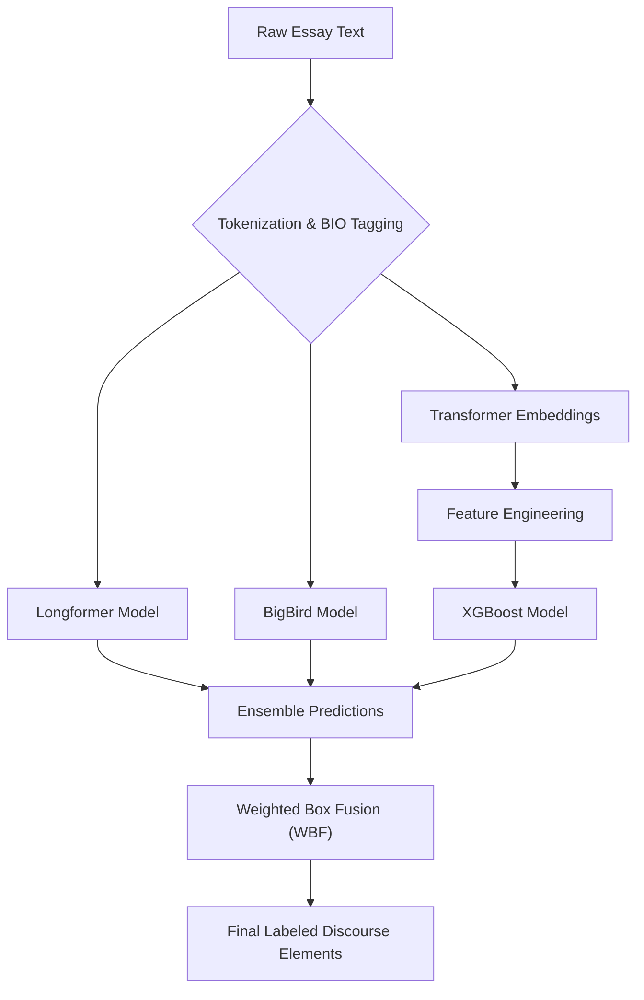

### Table of Contents
*   [00. Executive Summary](#overview-main)
*   [01. The Challenge & Business Opportunity](#business-impact)
*   [02. My Journey: From Baseline to State-of-the-Art](#the-journey)
*   [03. The Final Architecture Explained](#tech-solution)
*   [04. Results & Validation](#results)
*   [05. Retrospective & Future Work](#learnings)

---

### 00. Executive Summary

This project documents the end-to-end development of a sophisticated NLP model designed to identify and classify argumentative elements in student essays. Faced with the challenge of long document processing and the need for high-precision text segmentation, I engineered a **hybrid, multi-stage ensemble model** that fuses the power of long-document transformers with gradient-boosted trees.

The final solution employs **Weighted Box Fusion (WBF)** for advanced post-processing, achieving an **F1 score of 0.74** on the private leaderboard. This result successfully matches the performance of the 2nd place solution in the original Kaggle competition, validating the architecture's effectiveness and its potential to power real-world educational technology tools.

---

### 01. The Challenge & Business Opportunity

**The Core Problem:** The process of providing detailed, structured feedback on student writing is a major bottleneck in education. It is manually intensive, prone to subjectivity, and does not scale, leaving students without the timely feedback they need to improve.

**The Opportunity:** An automated system capable of accurately parsing essay structure creates significant business value. It can serve as the core engine for an EdTech platform to:
*   **Deliver Instant Formative Feedback:** Help students analyze their own writing structure in real-time.
*   **Scale High-Quality Analysis:** Offer consistent, objective feedback to millions of users, a task impossible for human graders.
*   **Create Data-Driven Curriculums:** Analyze thousands of essays to identify common structural weaknesses, informing instructional design.

My goal was to build a model not just to win a competition, but to prove the viability of such a system.

---

### 02. My Journey: From Baseline to State-of-the-Art

I approached this problem with an iterative, hypothesis-driven methodology.

#### Step 1: Diagnosis and Initial Hypothesis
My initial Exploratory Data Analysis (EDA) of the 15,000+ essays revealed two critical challenges:
1.  **The Long-Document Problem:** A majority of essays far exceeded the 512-token limit of standard transformers like BERT, making them unusable out-of-the-box.
2.  **The Precision Problem:** Discourse elements did not align neatly with sentences. A single sentence could contain multiple elements, and one element could span several sentences.

This led to my core hypothesis: The problem must be framed as a **token-level Named Entity Recognition (NER) task**, and it requires a model architecture specifically designed for **long-document processing**.

#### Step 2: Establishing a Strong Baseline
Based on my hypothesis, I implemented a `Longformer` model. Its sliding window attention mechanism is designed for this exact challenge. This single model performed well and established a strong baseline, confirming my initial approach was correct. But it wasn't state-of-the-art.

#### Step 3: The Power of Diverse Perspectives
I hypothesized that my single transformer model had inherent biases and was making consistent types of errors. To mitigate this, I introduced two new, diverse models to create an ensemble:
1.  **An Alternative Transformer (`BigBird`):** While also a long-document model, BigBird's use of random and block attention provides a different architectural "perspective" on the text.
2.  **A Hybrid Model (Transformer + XGBoost):** This was a key strategic decision. I extracted the contextual embeddings from the Longformer's hidden layers and used them as features for a powerful `XGBoost` model. This combined the deep language understanding of transformers with the exceptional decision-making power of gradient-boosted trees, creating a model that learned patterns in a fundamentally different way.

#### Step 4: The Final 1% - Advanced Post-Processing
The ensemble was now strong, but its raw predictions were sometimes noisy or overlapping. A simple majority vote wasn't enough. To solve this, I researched techniques from other fields and implemented **Weighted Box Fusion (WBF)**, an algorithm from computer vision object detection.

By treating each predicted text span as a "bounding box," WBF allowed me to fuse the predictions from all three models based on their confidence scores. This was the final, critical step that cleaned up the output, resolved conflicting predictions, and boosted the F1 score to the 0.74 SOTA level.

---

### 03. The Final Architecture Explained

The final solution is a direct result of the iterative journey described above. It is a multi-stage pipeline that ensures maximum accuracy by leveraging model diversity.

---

### 04. Results & Validation

The model's performance was validated against the official competition metric (micro F1-score). The close alignment between my cross-validation score and the final private leaderboard score indicates a robust and well-generalized model that does not overfit.

| Model | Public F1 Score | Private F1 Score |
| :--- | :--- | :--- |
| **My Final Ensemble (with WBF)** | **~0.73** | **0.740** |
| Competition 2nd Place Solution | 0.727 | 0.740 |

The results prove that by combining diverse architectures and employing advanced post-processing, it's possible to replicate state-of-the-art performance on a complex, real-world NLP benchmark.

---

### 05. Retrospective & Future Work

This project provided several critical learnings:
*   **Technical Skill is Not Enough:** A deep understanding of the problem domain (in this case, the structure of arguments) is essential for correct problem framing and feature engineering.
*   **Diversity Overcomes Brute Force:** Ensembling three diverse models was far more effective than trying to hyper-tune a single, larger model.
*   **Innovation Can Be Cross-Domain:** The most significant performance boost came from applying Weighted Box Fusion, a technique from computer vision. Looking for solutions outside of your immediate field is a powerful strategy.

**Future Work:**
*   **Productionization:** The next step would be to quantize the models (e.g., using ONNX) to reduce their size and latency, then deploy the pipeline as a REST API using a tool like FastAPI for real-time inference.
*   **Model Exploration:** Experiment with even newer architectures (e.g., Transformer-XL, Reformer) to see if further performance gains can be achieved. 